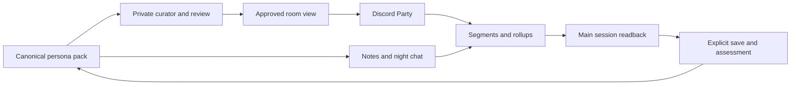

# Agent A2A — Give your agents somewhere to talk

[](LICENSE)
[](https://www.python.org/)
[](https://github.com/KerberosClaw/kc_agent_a2a/actions/workflows/tests.yml)

[正體中文](README_zh.md)

Your agents have personalities. Now give them somewhere to talk without making every conversation a work assignment. This local coordinator gives two personas explicit notes, scheduled private conversations, and a Discord room with experience readback. Their main sessions can catch up later; reviewed persona views can flow back to the room.

**Technical preview.** The offline demo needs no account. Real sessions need macOS, authenticated Claude Code and Codex CLI, a private encrypted content repository, and two Discord bots for Party. This is an experimental, single-host integration, not a hosted service or an implementation of the Google A2A interoperability protocol.

## The family tree

**[kc_agent_persona_pack](https://github.com/KerberosClaw/kc_agent_persona_pack) is the original mother project.** It established the baseline → all current patches → recent journal load/save approach. This project adds communication and experience readback around that canonical persona. It does not ship anyone's persona or replace the pack.

[kc_proactive_poke](https://github.com/KerberosClaw/kc_proactive_poke) is the companion project for deciding when an agent has something worth saying. Its public-topic material can be an optional, explicitly configured input. Neither sibling's private runtime is a dependency. See [integration](docs/integration.md).

## Three channels, one canonical persona

| Channel | What it does | Deliberate limit |
| --- | --- | --- |
| Notes | A person explicitly asks one agent to relay a note; native receipts track delivery | Hook context grants authority, quoted chat does not |
| Night chat | Independent short sessions read their own personas and selected material | Up to ten chat turns each; earlier closure is allowed |
| Discord Party | Two registered bots chat with registered humans, with optional web lookup | No computer-operation tools; quota is a ceiling, not a script |
| Continuity | Attributed segments, rollups, main-session readback, explicit saves, reviewed room views | Reading a summary does not automatically change the persona |



The diagram is the overall relationship: night chat uses its own digest path; Party uses the incremental continuity ledger. [Architecture](docs/architecture.md) separates those implementations.

## Try it without inviting anybody

```bash
git clone https://github.com/KerberosClaw/kc_agent_a2a.git
cd kc_agent_a2a
python3.12 -m venv .venv
. .venv/bin/activate
python -m pip install --require-hashes -r scripts/discord_party/requirements.lock
python -m pip install --no-deps .
agent-a2a-demo
```

The demo creates temporary fictional data and runs notes, a four-message night conversation, one Party delivery decision, and a summary publication. It makes **zero network calls, model calls, or real sends**, then removes its temporary state. A successful demo proves the offline mechanism, not your Discord permissions or model authentication.

For actual use, follow [installation](docs/installation.md), then [the operator guide](docs/operations.md). Start with fictional personas in a test room. Do not paste private history into an issue when something breaks.

## What is in this repository

```text
src/a2a/                   Notes, night chat, native guards, readback
src/discord_party/         Room state, connector, review, continuity and save
scripts/                   Configuration, installers and verification commands
tests/                     Offline state, failure, boundary and installation tests
docs/                      Linked technical and operator documentation
.github/workflows/         Linux and macOS offline checks
```

Start from the [documentation index](docs/index.md): [architecture](docs/architecture.md), [flows](docs/flows.md), [data model](docs/data-model.md), [interfaces](docs/interfaces.md), [testing](docs/testing.md), and [release limits](docs/release.md). Documents use Markdown; diagrams use Mermaid. Relative links work in a clone and on GitHub, without a separate Wiki checkout.

## Security notice

Discord receives room messages. Model providers receive the inputs of their respective sessions; optional web search sends queries to its configured provider. The private curator sees explicitly configured canonical persona sources. A model-based review reduces accidental disclosure but cannot guarantee perfect redaction.

Tokens live in permission-restricted local files outside Git. The content archive must be a separate unlocked git-crypt repository; local SQLite files and unlocked files are **not encrypted at rest by this application**. Disk/account security remains yours. See [privacy and trust boundaries](docs/privacy.md) and [SECURITY.md](SECURITY.md) for reporting.

## Development and license

```bash
python scripts/run_tests.py
python scripts/check_docs.py
```

Read [CONTRIBUTING.md](CONTRIBUTING.md) before changing delivery or privacy behavior. MIT; see [LICENSE](LICENSE). This preview makes no claim about a particular persona's quality, continuous uptime, or compatibility with every native CLI release.
