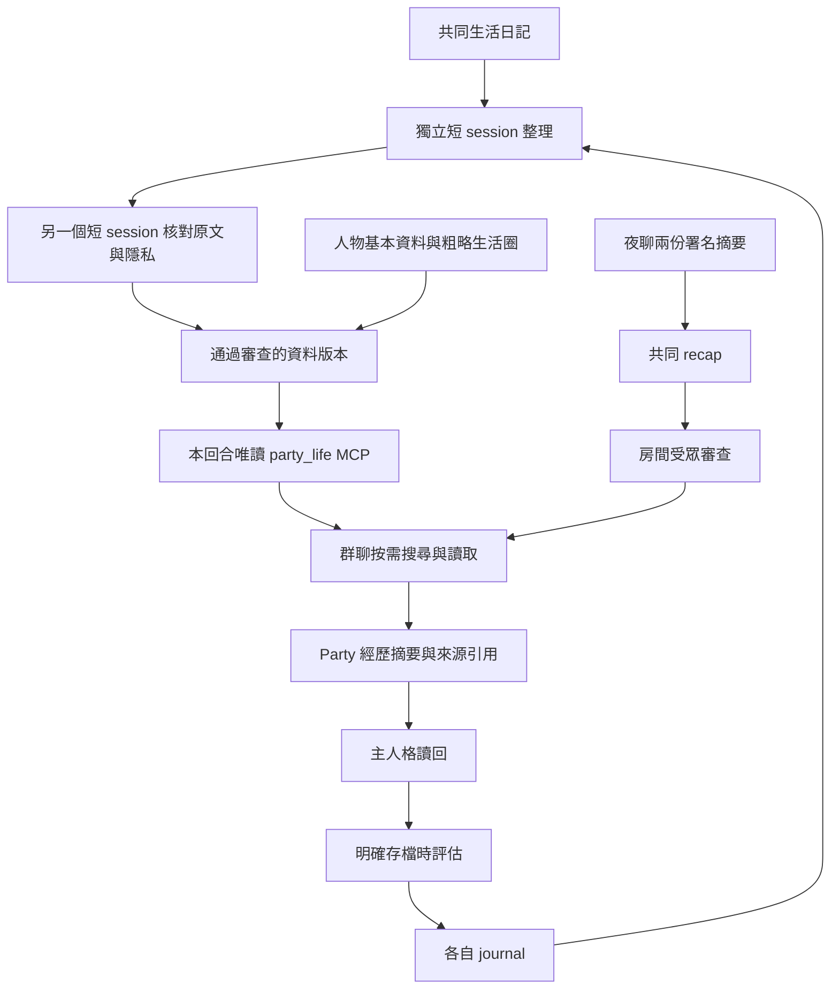
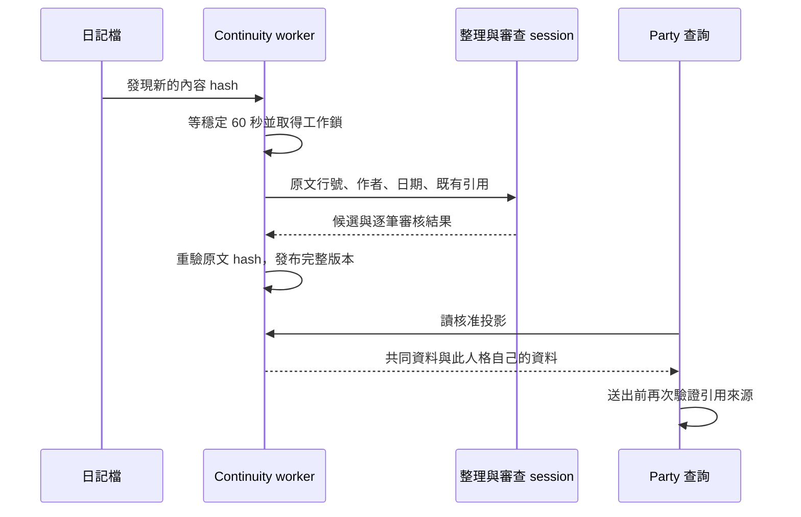

# 讓 Party 接得上生活與夜聊

> **English summary:** Optional audience-bound context uses an ephemeral read-only MCP server. Background workers curate shared daily entries and each agent's own journals into reviewed projections; source provenance survives Party readback without automatically changing canonical personas. All examples are fictional.

[文件索引](index.md) · [安裝](installation.md) · [介面](interfaces.md) · [隱私](privacy.md)

## 先分清楚四種內容

| 內容 | 來源與用途 | 不代表什麼 |
| --- | --- | --- |
| 人格視圖 | 各自正式基線與 patches 經整理／審查後的房間版本 | 不另建 Party 專屬永久人格 |
| 共同生活資料 | 操作者指定的生活日記，整理一次，供兩隻查閱 | 不把原始日記全文塞進群聊 |
| 自己的相處脈絡 | 各自 journal 的事件、玩笑與反應 | Agent A 不取得 Agent B 的私人相處史 |
| 夜聊共同摘要 | 同一場已完成夜聊的兩份署名摘要，保留各自觀點與原訊息引用 | 不把某隻的觀點改寫成雙方共同事實 |



## MCP 是房間內的受限查詢工具

`party_life.search` 接收 query、kind、page_size 與 cursor；`read` 接收搜尋回傳的 ID。模型可換詞、翻頁、讀取及追查關聯，沒有預先猜六筆資料就當全部的限制。每次決定最多八次工具呼叫、有效期 75 秒，超限會明確回報不完整；實際模型回合也有自己的時間上限。

它只搜尋操作者核准的資料投影，不可選磁碟路徑、受眾或任意 URL，不支援寫入、shell 或電腦操作。HTTP server 只綁 loopback，使用每回合短效能力 token，回合結束即關閉。原生工具軌跡只允許這兩個 MCP 方法及原本核准的網頁搜尋。這是應用內的小型 MCP server，不需要另一個 repo 或常駐資料庫服務。

查無資料表示「這個分享範圍沒有可用資料」。一隻說明缺資料後，另一隻若沒有新增資訊就應等待。程式會抑制同一問題下的重複回答及無新資訊接力；它不是自然語言品質保證。一般聊天上限 80 字元，資訊型回答 200，真人明確要求展開／查資料時 500；字元不是 token。額度仍是上限，不能強迫兩隻湊滿十句。

## 準備自己的資料目錄

本功能預設不啟用。它支援一種明確的 Markdown 目錄格式，**不是任意知識庫的通用匯入器**：

```text
knowledge/
  people/林登.md
  raw/entries/20260901.md
personas/agent_a/
  journal/20260901.md
personas/agent_b/
  journal/20260901.md
installation/party/
  config/life-context.json
  shared-context/               程式產生，必須和來源分開
```

人物只讀 frontmatter；正文不對房間開放。目前 parser 支援單行欄位及逗號分隔的陣列，不是完整 YAML parser。以下姓名、關係與日期皆為虛構：

```markdown
---
name: 林登
aka: [小林, Linden]
relationship: 老同學
met_via: 同學
---
這裡的原始正文不會經人物查詢工具提供。
```

基本關係採允許類型與拒絕詞規則。`people_overrides` 用於少數明確覆寫，不需逐人開白名單；覆寫欄位及 `home_context.area` 是操作者批准的文字，**程式不會替操作者保證輸入已去敏**。只填可讓房間看到的稱呼、基本關係與行政區／大型地標，勿放門牌、座標、即時位置或小說化名。這些人工欄位與模型審查的日記資料是不同信任來源。

生活日記與 journal 使用 `YYYYMMDD.md`；以台灣日期為基準，不收未來日期。同一來源內同一天只可有一份；移動到 journal 子資料夾不算新事件，但不能留下同日期副本。每份上限 128 KiB，禁止 symlink 與路徑逃逸。初次各取最近五篇（共最多十五篇），之後偵測新增／修訂，檔案穩定至少 60 秒才整理。私人日記可能送至背景模型供應者，啟用前須接受這個資料流。

## 核准與啟用

1. 先照[安裝](installation.md)建立並核准房間。停止本套 Party 及其 continuity 排程；若啟用了 watchdog，先暫停它。
2. 複製 [life-context.example.json](../scripts/discord_party/life-context.example.json) 到 runtime 的 `party/config/life-context.json`，權限設 `600`。範例是 `pending`，不能直接啟用。
3. 填入實際的擁有者、房間與完整真人 ID 清單、來源絕對路徑；受眾須與兩份 registry 完全相符。`approved_by` 必須是 bot 擁有者；目前一份共同政策要求兩隻由同一位操作者核准。
4. 若只需人物／生活圈查詢，刪除 `shared_context` 區塊。若啟用日記整理，該區塊的 `journal_roots` 填人格**根目錄**（不是 journal 子目錄），必須與 `continuity-config.json` 的 `interactive_roots` 一致；兩個 bot ID 也須一致。`root` 必須是 `<party_runtime>/shared-context`，`backfill_count` 固定為 5。
5. 在 `continuity-config.json` 增加 `life_context_policy`，指向這份政策絕對路徑。審閱資料與分享範圍後，把政策 `status` 改成 `approved`，填入實際 `approved_at`；不是每寫一篇日記就再批准一次。
6. 執行下面的整理指令。第一次通常只回報 pending；滿 60 秒後再執行，才會呼叫原生模型。每篇合格來源先呼叫一次整理；有候選記錄才另呼叫一次獨立審查，空候選不做第二次。失敗重試另計，詳見[模型呼叫盤點](model-calls.md)。日常 worker 每輪最多三篇，手動回填可用 `--max-documents 15`。

```bash
python scripts/discord_party/shared_context.py \
  --config "$HOME/agent-a2a-preview/continuity-config.json" \
  --max-documents 15 tick
python scripts/discord_party/shared_context.py \
  --config "$HOME/agent-a2a-preview/continuity-config.json" status
```

確認結果並抽查 `shared-context/versions/` 的核准記錄後，再依維運指引啟動 Party／恢復排程。管理器只在政策檔存在時把它交給兩隻 bot。共同日記整理一次；每隻只能查共同記錄及自己的相處記錄。更改政策會使正在執行的查詢失效，修改後須重啟本套 Party，不能趁執行中擴大受眾。

## 寫完日記之後會發生什麼

既有 continuity worker 共用同一把 `worker.lock`，不新增第二個排程器。來源 hash、日期 ID、政策版本及原子指標讓整理不會半套發布。修訂／刪除的來源立即停止提供舊投影，通過審查後才恢復；失敗的來源退避一小時並在狀態持續顯示 failed，其他合格來源仍可使用。



Party 經歷摘要與原始日記分開存；正式人格仍在明確存檔時自行評估。引用跟著 Party 回覆進入後續摘要／存檔 manifest，讓重述舊事不被當成新的獨立證據。這是可追溯設計，不宣稱完全消除模型重述或長期漂移。

## 夜聊、Poke 與停用

已正常結束的夜聊保存共同 `recap.json`，保留兩份署名摘要與訊息 ID；Party 只使用近期、經受眾審查的素材，問「昨晚」時會按日期檢查。原本各自摘要與主對話讀回仍保留。舊的完整 snapshot 可在讀取時建立等價 recap，不改原件。

這次發布只更新 A2A。外部 Poke 若要主動引用共同摘要，需另行接上此格式並驗證權限；不能把「有共同摘要」說成公開 Poke 已自動整合。見[整合](integration.md)。

停用時先停止本套 worker／Party，移除 `continuity-config.json` 的 `life_context_policy`，並把 `party/config/life-context.json` 搬出管理器使用的檔名，再啟動。保留來源、帳本與舊版本供對帳；刪投影不會撤回已送到 Discord 的訊息。

實作與回歸入口：[life_context.py](../src/discord_party/life_context.py)、[life_tools.py](../src/discord_party/life_tools.py)、[shared_context.py](../src/discord_party/shared_context.py)、[共享脈絡測試](../tests/discord_party/test_shared_context.py)、[MCP 測試](../tests/discord_party/test_life_tools.py)。

## 讓模型看到這一題需要的脈絡

[prepare_chat](../src/discord_party/dialogue.py)建立本次輸入投影，不改已保存的房間歷史。以最後一則真人訊息的時間換算 Asia/Taipei，模型或另一隻 bot 的發言不能改掉這個時間基準：

| 問法（合成例句） | 已實作的資料選擇 |
| --- | --- |
| 「昨晚夜聊聊了什麼？」 | 真人訊息日期的前一天 18:00 至當天 12:00，結束時間不包含在內 |
| 「今天凌晨聊了什麼？」 | 當天 00:00 至 12:00，結束時間不包含在內 |
| 指定日期的夜聊／凌晨回顧 | 依指定日期套用上述晚間／凌晨窗口 |
| 「最近的夜聊內容？」 | 合格來源中時間最新的一場 |

只從目前核准、未過期的分享素材選擇 `origin=night/night_recap`，並核對每筆 host 提供的 `occurred_at`，排除晚於真人訊息的來源。夜聊回顧會移除本次輸入中的舊房間摘錄、Party 經歷及生活資料，保留當前真人回合和選中的夜聊素材；找不到時回報沒有可用回顧，不能改用別晚或白天的 Party 故事。

明確的新住家周邊搜尋，例如合成問句「幫我找我家附近的圖書館」，會移除本次輸入的舊房間摘錄／經歷並從當前真人回合開始，避免舊推薦被當成新搜尋答案。一般聊天與依賴前文的追問保留脈絡。這是有限的詞句規則，不是通用語意路由器，也不保證所有換話題都被識別。回歸見[dialogue 測試](../tests/discord_party/test_dialogue.py)。

## 查特定事件與瀏覽近期互動

`party_life.search` 的一般關鍵詞須同時命中，另有姓名／別名比對。把整段「最近和我發生什麼有趣互動」塞進 query，可能只是條件太窄。具體問題用短姓名或關鍵詞；泛問近期相處可用 `query=""`、`kind="interaction"` 依日期瀏覽，再讀結果 ID。這是本工具的契約，不能套用到所有搜尋服務。

`has_more=true` 表示尚未讀完，應沿同一 query、kind、page_size 的 `next_cursor` 翻頁。一次零命中或只有第一頁，都不足以宣稱沒有相關資料。`ambiguous` 需釐清對象，不能任選一人；預算用完要說明資料不完整。完整[狀態語意](interfaces.md#生活查詢狀態)與[分頁／權限測試](../tests/discord_party/test_life_tools.py)可用於整合驗收。

## 沒有新資訊時安靜

一般聊天決定帶 `contribution`，分類與發言來自**同一個模型結果**，沒有額外判官呼叫：

| 分類 | 用途與程式處理 |
| --- | --- |
| `answer` | 回答當前問題；夜聊回顧中，自己已回答過則再答會被轉為 `pass` |
| `new` | 新資訊或有內容的新互動，仍經一般送出檢查 |
| `correction` | 更正，仍經一般送出檢查 |
| `none` | 轉為無內容的 `pass`；原本已是無內容 `close` 時保留關閉 |

這能抑制空接力，不能證明模型分類正確或所有重述都被消除。判斷後 `pass` 仍已消耗一次模型呼叫；詳見[呼叫盤點](model-calls.md)。實作：[settle_contribution](../src/discord_party/dialogue.py)。
