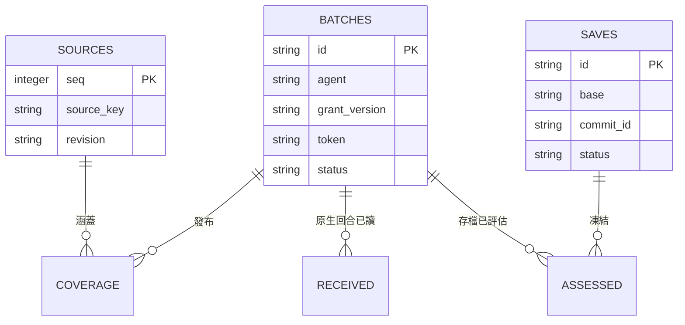

# 資料模型與管理責任

> **English summary:** A2A, per-bot Party, and continuity use separate SQLite stores with local transactions. Source coverage, receipts, and save records support reconciliation, but no transaction spans SQLite, models, and Git.

[文件索引](index.md) · [Schema 附錄](schema.md) · [流程](flows.md)

系統有三套獨立 SQLite schema。紙條在 A2A store 加入信箱授權／回合資料表；每個 bot 各有一份 Party 資料庫，continuity 則使用另一份共用帳本。資料庫使用本機鎖與交易，沒有分散式鎖服務。

| 儲存位置／產物 | 管理者 | 用途 |
| --- | --- | --- |
| Runtime A2A SQLite | 紙條／夜聊協調程式 | 紙條、場次、嘗試、已接受訊息、游標、匯出 |
| Runtime mailbox SQLite | 原生紙條服務 | 限定回合／操作授權與候選回執證據 |
| `party/state/<slot>/party.sqlite3` | 單一 bot 協調程式 | Registry、額度、epochs、事件、outbox 與決定嘗試 |
| `continuity/continuity.sqlite3` | Continuity 協調程式／hook | 來源、批次、涵蓋範圍、領取、回執、存檔與評估 |
| `party/review/` | 操作者 | 核准受眾與經 hash 綁定的人格卡 |
| `party/sharing/` | 整理器與審查程序 | 不可變的核准衍生視圖與目前指標 |
| `party/shared-context/` | 既有 continuity worker | 來源 hash／狀態、審查後版本與原子 current 指標 |
| `party/watchdog/state.json` | 選用 watchdog | boot、故障去重與通知回執 |
| 內容庫 `runs/<id>/recap.json` | 夜聊封存寫入器 | 同場兩份署名摘要的共同讀取面 |
| 私人內容 Git | 依序寫入的封存程序 | 對話、已發布摘要與復原 metadata |
| 正式人格 Git | 主人格明確存檔 | 基線、現行 patches 與 journal |

圖中呈現 continuity 已宣告的外鍵關係，不包含所有資料表／欄位。[Schema 附錄](schema.md) 列出程式產生的實際 DDL；JSON 引用與 manifest 另由應用層驗證。每個人格對各來源序號的涵蓋紀錄須唯一；來源身分加上修訂用於匯入去重。每個人格只能有一個尚未結束的存檔。

SQLite、模型與 Git 之間沒有跨系統交易。輸入在本機交易內凍結，昂貴工作在交易外執行，再以 token／版本檢查阻止過期結果發布。Git commit manifest 與回執可協助中斷後對帳。使用 SQLite backup API 備份資料庫；key 與 runtime 備份須放在公開 repo 之外。

`context_origins` 以 Party outbox 的 request_id 關聯 `source_refs`；封存事件、continuity 摘要與存檔 manifest 保留來源引用。衍生日記投影使用 JSON 版本檔，沒有新增第四套資料庫。來源修訂使舊投影失效；詳見[共享脈絡](context.md)。
