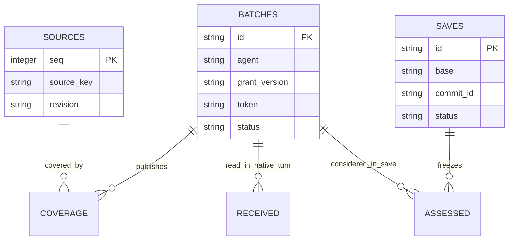

# Data model and ownership

[Documentation index](index.md) · [Schema appendix](schema.md) · [Flows](flows.md)

There are three independent SQLite schema families. Notes add mailbox capability/turn tables to the A2A store. Each bot has its own Party database; continuity has a separate shared ledger. Databases use local locking/transactions rather than a distributed lock service.

| Store / artifact | Owner | Purpose |
| --- | --- | --- |
| Runtime A2A SQLite | Note/night coordinator | Notes, runs, attempts, accepted messages, cursors, exports |
| Runtime mailbox SQLite | Native note service | Scoped turn/capability and candidate receipt evidence |
| `party/state/<slot>/party.sqlite3` | One bot coordinator | Registry, quota, epochs, events, outbox and attempted decisions |
| `continuity/continuity.sqlite3` | Continuity coordinator/hooks | Sources, batches, coverage, claims, receipts, saves and assessments |
| `party/review/` | Operator | Approved audience and hashed persona cards |
| `party/sharing/` | Curator and audit | Immutable approved derived views and current pointer |
| Private content Git | Serialized archive writer | Conversations, published summaries and recovery metadata |
| Canonical persona Git | Main persona explicit save | Baseline, current patches and journal |

The diagram shows declared continuity foreign-key relationships, not every table/column. The [schema appendix](schema.md) enumerates actual DDL from code. JSON refs/manifests are also validated at application level. Per-persona coverage is unique per source sequence; source identity plus revision deduplicates ingestion. An open save is unique per persona.

No SQLite/model/Git cross-system transaction exists. Inputs are frozen under a local transaction, expensive work runs outside it, and token/version checks fence publication. Git commit manifests and receipts support reconciliation after interruption. Back up databases through SQLite's backup API; keep keys and runtime backups separate from this public repo.
