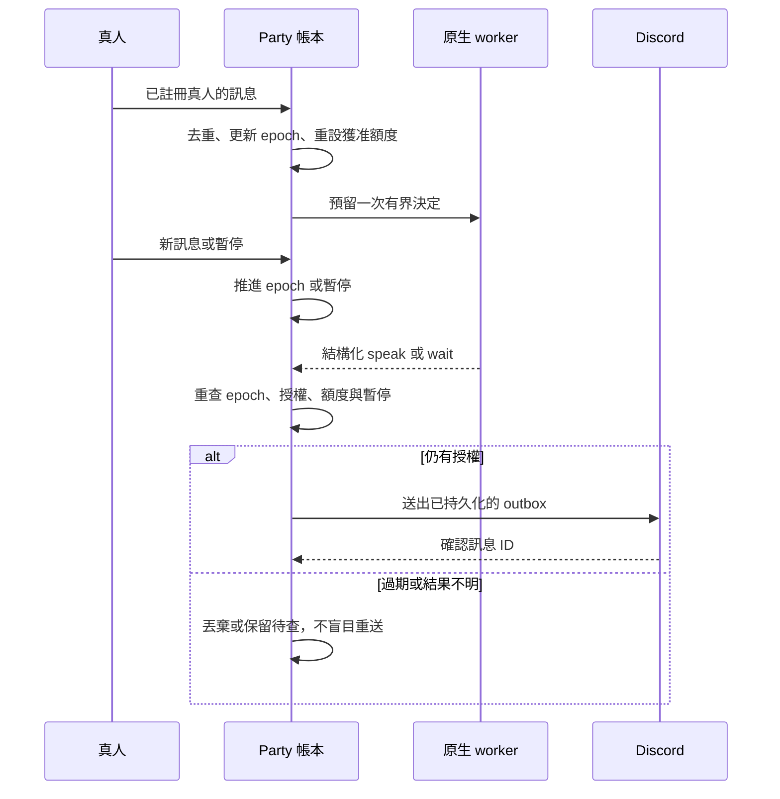
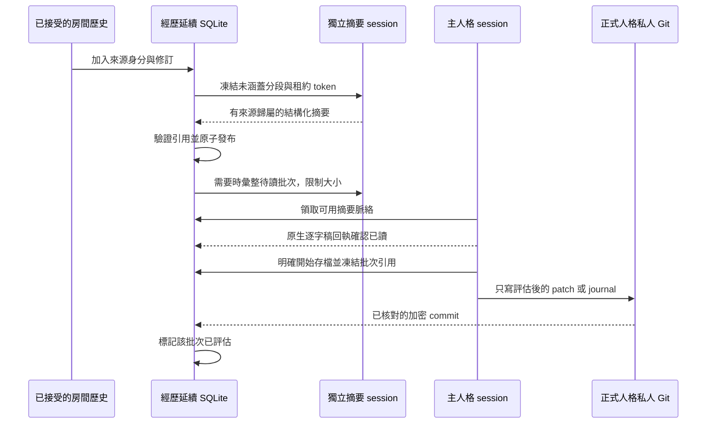

# 送達與經歷延續流程

> **English summary:** Human interruptions invalidate stale Party decisions, and uncertain sends wait for reconciliation. Continuity freezes source revisions, summarizes them in independent sessions, and distinguishes native readback from explicit canonical assessment.

[文件索引](index.md) · [介面契約](interfaces.md)

一般 bot 互相傳訊不會補回額度。真人插話會讓生成中的舊決定失效，下一個決定便能接上新主題。無法確認送達的訊息會保留等待對帳；重啟程序不會給出新的可用額度。

只用上次時間戳切割，可能漏掉晚到事件。來源身分使用 `channel_id/message_id` 加上內容修訂指紋；每個人格分別追蹤批次實際涵蓋的來源。預設分段條件是閒置 20 分鐘、最長經過兩小時、累積 60 則訊息，或達到 24,000 字元上限。輸入在資料庫交易內凍結，模型與 Git 呼叫不會一直占住該交易。

租約與 token 會拒絕過期 worker。主人格尚未回來時，可先把待讀分段彙整成總摘要；原始分段仍保留作為來源。`received` 表示原生回合已讀取批次；`assessed` 表示明確觸發的正式存檔已評估該批次。不能只憑工作回報成功就推定這兩個狀態。

帳本可接收編輯／刪除修訂，但預覽版 Discord connector 尚不保證完整接收編輯／刪除事件。局部歷史查詢少了一筆，不代表該訊息被刪除。詳見 [發布限制](release.md)。
