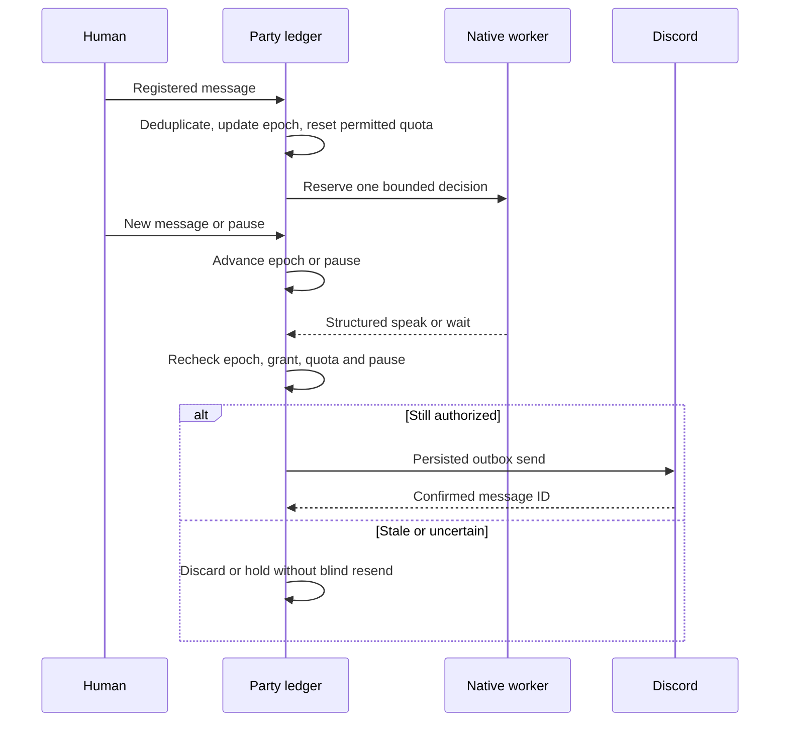
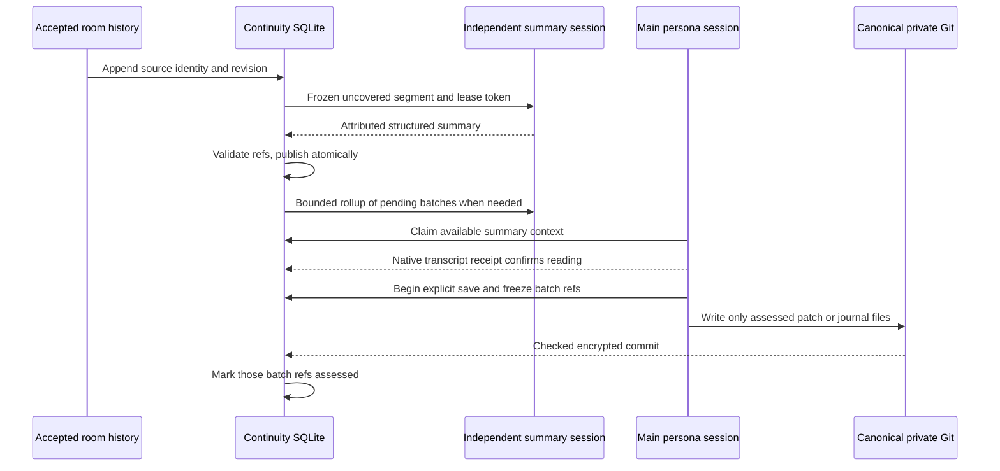

# Delivery and continuity flows

[Documentation index](index.md) · [Interfaces](interfaces.md)

An ordinary bot-to-bot message never replenishes quota. A human interruption invalidates an in-flight decision so the next decision can follow the new topic. Unknown delivery is held for reconciliation; a process restart does not grant fresh spending.

Cutting by a last timestamp alone can miss late events. Source identity is `channel_id/message_id` plus a revision fingerprint; per-persona coverage tracks exactly what a batch included. Default segment triggers are 20 minutes idle, two hours maximum age, 60 messages, or the 24,000-character bound. The database transaction freezes inputs; no model or Git call holds that transaction open.

Leases and tokens reject stale workers. A rollup can summarize pending segments before the main persona visits; original segments remain the provenance source. `received` means a native turn consumed a batch; `assessed` means an explicit canonical save considered it. Neither is inferred from a job saying it succeeded.

Edit/deletion revisions can be ingested by the ledger, but the preview Discord connector does not promise complete edit/delete event ingestion. A missing record in a partial history fetch is not a deletion. See [release limitations](release.md).
