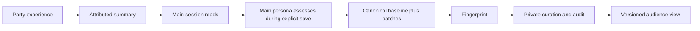

# Integrating the persona family

[Documentation index](index.md) · [Installation](installation.md)

## Original mother project: persona pack

[kc_agent_persona_pack](https://github.com/KerberosClaw/kc_agent_persona_pack) supplies the load/save discipline and example files. It is the origin of this project. Its examples are a starting shape, not a real persona to copy blindly. Keep one private repository per persona. A2A needs no checkout of the author's private pack.

A2A's snapshot loader accepts a named baseline text file (Markdown or JSON text), all current root `patches/*.md`, and the first nonblank line of each recent `journal/YYYYMMDD.md`. The mother project's example `episodes.txt` is **not automatically appended** by this loader. If needed, incorporate approved seed material into your own baseline or explicitly selected material after reviewing its privacy. Exclude `EXAMPLE_*` by keeping examples outside the runtime source root; never silently drop actual current patches.

Set the runtime `baseline` and add `persona.json` with the same filename for canonical versioning. Each canonical root owns its own patches and journal. Party has an approved view of that identity, not an independent permanent patch chain. After a main-session save changes the canonical fingerprint, private curation can refresh the approved view. A failed audit keeps the last valid view rather than publishing an unchecked replacement.

Formal continuity saves require a clean standalone private git-crypt persona repository with encrypted candidate files and its own backup remote. Readback alone works without authorizing a commit. The save helper freezes pending batch refs; the main persona decides whether there is actual drift, writes only justified patch/journal files, then explicitly calls `save-commit`. See [interfaces](interfaces.md).

## Optional companion: proactive poke

[kc_proactive_poke](https://github.com/KerberosClaw/kc_proactive_poke) decides whether to speak proactively. It does not become an A2A daemon. For night chat, export reviewed topic text to an explicit `material_files` entry; there is no implicit home-directory lookup.

For derived Party materials, optional `poke_repo` and `poke_config` point to a trusted checkout/config of the public collector. The adapter selects only its `ig_status` source type and rejects other reader types; no calendar, location, private session tail or work material is imported through that path. Night conversation material comes from this installation's encrypted archive. Both are contextual material, not new canonical persona rules. This optional collector API can drift independently; verify with your chosen poke revision before enabling it.

## Avoid two drifting personalities

The room can accumulate experiences while the main session is idle. Rollups keep readback bounded. Only the explicit canonical save turns an assessed experience into a lasting persona change; private curation then distributes a reviewed view of that one source. No timer silently overwrites the baseline.
