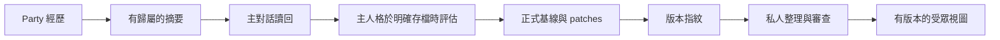

# 整合人格家族專案

> **English summary:** The original persona-pack project supplies load/save discipline; proactive poke can supply explicitly selected materials. Party views derive from one canonical persona source, while experiences return through readback and an explicit save.

[文件索引](index.md) · [安裝](installation.md)

## 最初的母專案：persona pack

[kc_agent_persona_pack](https://github.com/KerberosClaw/kc_agent_persona_pack) 提供人格載入／存檔紀律與範例檔，也是本專案的起點。範例只供建立結構參考，不是真實人格，不宜原樣照搬。每個人格使用獨立私有 repo；A2A 不需要取得作者的私人原人格庫。

A2A 快照載入器接受指定名稱的基線文字檔（Markdown 或 JSON 文字）、根層所有現行 `patches/*.md`，以及近期各份 `journal/YYYYMMDD.md` 的第一個非空白行。母專案的範例 `episodes.txt` **不會由此載入器自動附加**。若需要種子素材，先審查隱私，再整合進自己的基線或明確選取的素材。把 `EXAMPLE_*` 範例放在 runtime 來源根目錄之外，不能為了排除範例而默默漏掉真正的現行 patch。

設定 runtime 的 `baseline`，並在 `persona.json` 填入相同檔名，供正式人格版本追蹤。每個正式人格根目錄各自擁有 patches 與 journal。Party 使用該人格的核准視圖，不另養一條永久 patch 鏈。主對話存檔改變正式人格指紋後，私人整理流程可更新共享視圖；審查失敗就保留上次有效版本，不發布未通過的替代品。

正式經歷存檔要求乾淨、獨立的私有 git-crypt 人格 repo，候選檔案須加密，並設有自己的備份 remote。單純讀回摘要不需要授權 commit。存檔 helper 凍結待處理批次引用後，由主人格判斷是否真的有漂移，只寫有理由的 patch／journal，再明確呼叫 `save-commit`。詳見 [介面契約](interfaces.md)。

## 選用的夥伴：proactive poke

[kc_proactive_poke](https://github.com/KerberosClaw/kc_proactive_poke) 負責判斷是否主動開口，不會變成 A2A 常駐程序。夜聊可把已審查的話題文字匯出到明確指定的 `material_files`，不會暗中搜尋家目錄。

Party 衍生素材可選填 `poke_repo` 與 `poke_config`，指向受信任的公開收料器 checkout／設定。Adapter 只選取 `ig_status` 來源類型，拒絕其他 reader；不會透過這條路匯入行事曆、位置、私人 session 尾端或工作素材。夜聊素材則來自本套安裝的加密內容庫。兩者都只是對話脈絡，不是新的正式人格規則。選用收料器的 API 可能獨立變動，啟用前須與選定的 poke revision 一起驗證。

## 避免兩份人格各自漂移

主對話閒置時，房間仍可累積經歷，總摘要則限制讀回的上下文大小。只有明確觸發的正式存檔，才會把評估後的經歷變成持久的人格變化；私人整理流程再從同一個正式來源，產生審查過的共享視圖。沒有計時器會默默覆寫基線。
